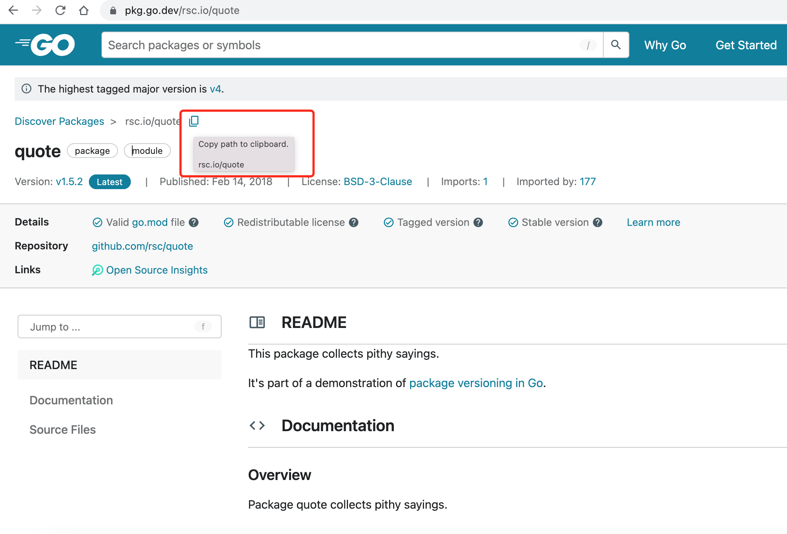

### Go开发环境的安装
下载相应操作系统的安装包进行安装即可。
详见官网：
https://go.dev/doc/install

安装完成后，使用 `version` 查看版本信息，检查是否成功。
```
% go version
go version go1.17.3 darwin/amd64
```

### HelloWorld
参考官网指导 https://go.dev/doc/code
```
% cat<<EOF > helloworld.go
package main
import "fmt"
func main(){
  fmt.Println("hello world!");
}
EOF
% go run helloworld.go
```

### Package
使用 `go mod init` 创建 `go.mod`文件：
```
% go mod init helloworld
go: creating new go.mod: module helloworld
```
创建子文件夹
```
% mkdir greeting
% cat<<EOF > greeting/greeting.go 
package greeting

func Hello() string{
  return "hello world!"
}
EOF
```
修改 helloworld.go 引用 `greeting` 包
```
% cat<<EOF > helloworld.go 
package main
import (
  "fmt"
  "helloworld/greeting"
)
func main(){
  fmt.Println(greeting.Hello());
}
EOF
```

运行：
```
go run .
```

### 第三方包依赖
依赖包查询地址：https://pkg.go.dev/

找到需要的依赖包并复制依赖路径，以 `quote` 包为例：



使用依赖：
```
% cat<<EOF > helloworld.go 
package main
import (
    "fmt"
    "rsc.io/quote"
)

func main(){
  fmt.Println(quote.Hello());
}
EOF
```

扫描并安装依赖包：
```
% go mod tidy 
go: finding module for package rsc.io/quote
go: found rsc.io/quote in rsc.io/quote v1.5.2
```

执行脚本：
```
% go run helloworld.go
Hello, world.
```

编译成执行文件运行：
```
% go build helloworld.go 
% ls
go.mod		go.sum		helloworld	helloworld.go
% ./helloworld 
Hello, world.
```

#### 编译成windows平台执行包
```
GOOS=windows GOARCH=amd64 go build helloworld.go 
```
