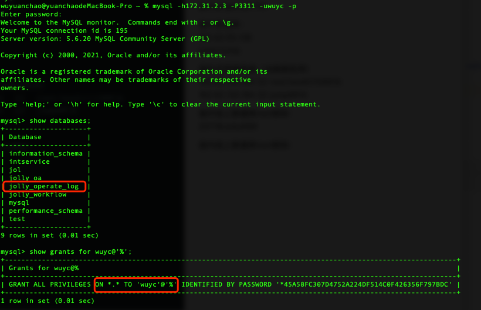
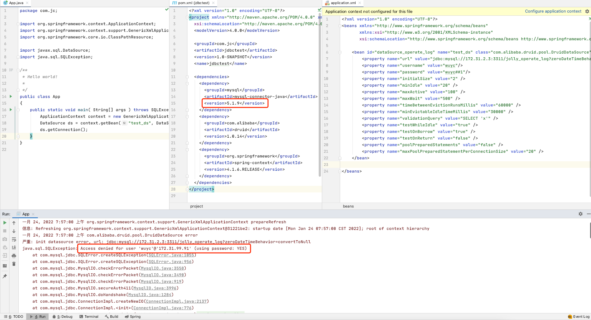
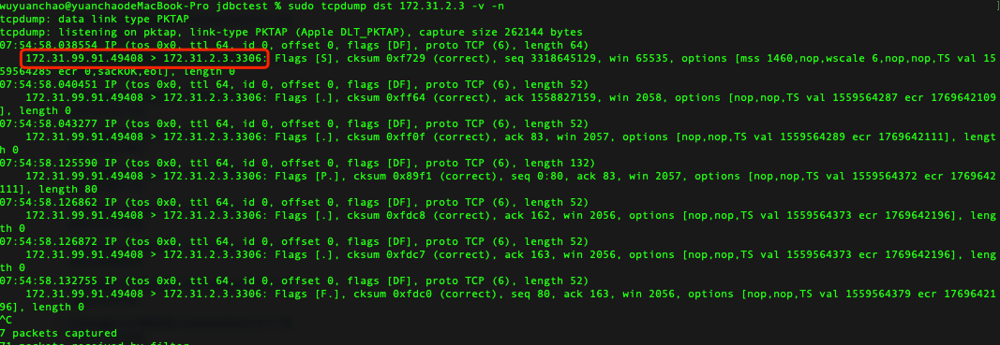
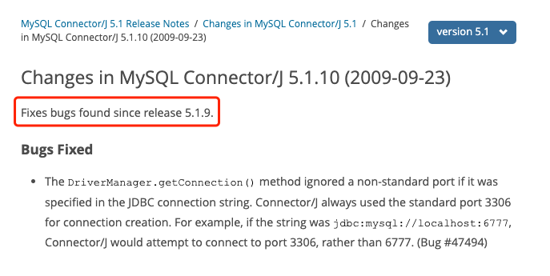

### mysql-connector-java-5.1.9 Bug记录

#### 1. 前置条件：数据库存在，用户拥有权限



```
% mysql -h172.31.2.3 -P3311 -uwuyc -p
mysql> show databases;
mysql> show grants for wuyc@'%';
```

#### 2. 现象：jdbc提示用户没有权限（3306端口需要有其他mysql服务存在）



```
<dependency>
  <groupId>mysql</groupId>
  <artifactId>mysql-connector-java</artifactId>
  <version>5.1.9</version>
</dependency>
```


#### 3. 原因：没有按配置，而是以默认端口连接mysql服务器



```
sudo tcpdump dst 172.31.2.3 -v -n
```

#### 4. 解决方案：升级到5.1.10



参考：https://dev.mysql.com/doc/relnotes/connector-j/5.1/en/news-5-1-10.html
