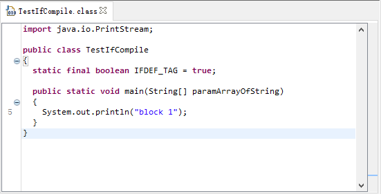

c/c++中可以使用#ifdef来进行条件编译，那么java支持条件编译么？

答案是：没有！

但与 IT 领域的惯例一样，也存在一种解决方法：使用条件为常量的if语句实现

----
$ cat TestIfCompile.java
public class TestIfCompile{
    static final boolean IFDEF_TAG = true;
    public static void main(String[] args){
        if(IFDEF_TAG){
                System.out.println("block 1");
        }else{
                System.out.println("block 2");
        }
    }
}
----

然后使用javac编译成class文件

----
$ javac TestIfCompile.java
----

再使用反编译工具查看TestIfCompile.class (jd官网：http://jd.benow.ca/)

----
$ java -jar jd-gui-1.4.0.jar
----

这个特性的使用场景之一：我们在开发时，经常会打印很多debug日志，如果为了追求极致的性能，可以在编译期把不需要的代码剔除。

再配合maven的templating-maven-plugin插件，就可以实现不同环境的条件编译了。

https://medium.com/@lutoc.bondar/the-conditional-compilation-in-java-9f9a327308aa
