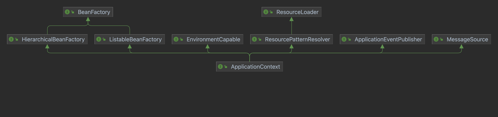

= Application Context
:toc:

== ApplicationContext接口设计
ApplicationContext是为应用程序提供配置的中央接口。从类图可以看出，它是BeanFactory的一个子接口，并且添加了Message resource的支持（用于国际化），事件发布等功能组合成一个功能强大的容器。
简单来说，BeanFactory提供配置框架和基本功能，ApplicationContext添加更多企业级应用功能。



> An ApplicationContext provides:
>
> - 继承了ListableBeanFactory，拥有访问应用程序组件的能力.
> - 继承了org.springframework.core.io.ResourceLoader，拥有以通用方式加载文件资源的能力。
> - 继承了ApplicationEventPublisher，拥有向注册的侦听器发布事件的能力。
> - 继承了MessageSource，拥有国际化的能力。
> - 继承了HierarchicalBeanFactory，拥有从父上下文继承Definitions的能力，且后代上下文中的BeanDefinition将始终优先。 

ApplicationContext作为一个应用容器。通常，人们会定义服务层对象、持久层对象（例如存储库或数据访问对象 (DAO)）、表示层对象（例如 Web 控制器)、基础设施对象(例如 JPA EntityManagerFactory、JMS 队列)等。而不会在容器中配置细粒度的领域对象，因为创建和加载领域对象通常是存储库和业务逻辑的责任。

== ApplicationContext实现 

AbstractApplicationContext 使用模版方法设计模式，不强制要求用于配置的存储类型,简单地实现了通用的上下文功能。具体的虚拟方法实现由子类完成。


> Load or refresh the persistent representation of the configuration, which might be from Java-based configuration, an XML file, a properties file, a relational database schema, or some other format.
>
> As this is a startup method, it should destroy already created singletons if it fails, to avoid dangling resources. In other words, after invocation of this method, either all or no singletons at all should be instantiated.

refresh是容器真正的启动方法，需要做的事情有：

[source,java]
----
// Prepare this context for refreshing.
prepareRefresh();

// Tell the subclass to refresh the internal bean factory.
ConfigurableListableBeanFactory beanFactory = obtainFreshBeanFactory();

// Prepare the bean factory for use in this context.
prepareBeanFactory(beanFactory);

// Allows post-processing of the bean factory in context subclasses.
postProcessBeanFactory(beanFactory);

// Invoke factory processors registered as beans in the context.
invokeBeanFactoryPostProcessors(beanFactory);

// Register bean processors that intercept bean creation.
registerBeanPostProcessors(beanFactory);

// Initialize message source for this context.
initMessageSource();

// Initialize event multicaster for this context.
initApplicationEventMulticaster();

// Initialize other special beans in specific context subclasses.
onRefresh();

// Check for listener beans and register them.
registerListeners();

// Instantiate all remaining (non-lazy-init) singletons.
finishBeanFactoryInitialization(beanFactory);

// Last step: publish corresponding event.
finishRefresh();
----

=== prepareBeanFactory()
prepareBeanFactory方法，对BeanFactory进行了配置:

1. 添加了两个 beanPostProcessors, ApplicationContextAwareProcessor（处理各种Aware接口） 和 ApplicationListenerDetector（需要尽早添加，用于发现并注册ApplicationListener）。

2. 注册各种 `Aware` 接口到 ignoredDependencyInterfaces 中，从而忽略它们的 依赖检查（dependency check） 和 自动装配（autowire）。

3. 将BeanFactory和ApplicationContext（没有BeanDefinition的定义）注册到resolvableDependencies。从而使它们可以被自动装配到依赖他们的实例中。

4. 注册4个默认单例（如果当前上下文没有配置）：
- environment 
the Environment bean in the factory.
- systemProperties 
the System properties bean in the factory. See Also: System.getProperties()
- systemEnvironment
the System environment bean in the factory. See Also: System.getenv()
- applicationStartup
the ApplicationStartup bean in the factory.

=== obtainFreshBeanFactory()
顾名思义，获取 Bean工厂。obtainFreshBeanFactory中包含两个虚方法：refreshBeanFactory 和 getBeanFactory。由子类完成实现。 比如ClassPathXmlApplicationContext在obtainFreshBeanFactory时，就是在refreshBeanFactory中完成从XML读取BeanDefinition并注册到容器中的。

=== invokeBeanFactoryPostProcessors()
和BeanPostProcessor处理的是Bean不同，BeanFactoryPostProcessors是对beanFactory进行处理。容器在invokeBeanFactoryPostProcessors过程中，会从beanFactory查找这个BeanFactoryPostProcessor，并分三个优先级（priorityOrdered， ordered， nonOrdered）依次实例化并执行真正的处理。处理BeanFactoryPostProcessors的顺序非常重要。

比如,我们在容器中配置PropertyPlaceholderConfigurer(它是一个处理占位符替换的BeanFactoryPostProcessor），在下例中，hello这个bean的message的值将使用config.properties配置文件中的配置值。如果这个"hello"对象，也是一个BeanFactoryPostProcessor，那么需要确保它在PropertyPlaceholderConfigurer处理完陈之后再进行处理。所以PropertyPlaceholderConfigurer实现了PriorityOrdered接口（PriorityOrdered objects are always applied before plain Ordered objects regardless of their order values）。

```
<bean id="propertyConfigurer" class="org.springframework.beans.factory.config.PropertyPlaceholderConfigurer">
    <property name="location">
        <value>config.properties</value>
    </property>
</bean>

<bean id="hello" class="org.example.model.Hello">
    <property name="message" value="${hello.example.message}" />
</bean>
```

在这个过程中通过`getBean`实例化的BeanFactoryPostProcessors，容器中只有prepareBeanFactory 过程中主动注册的ApplicationContextAwareProcessor 和 ApplicationListenerDetector 两个BeanPostProcessor。所以其他未注册(要到下一步在进行registerBeanPostProcessors)的 BeanPostProcessors 并不能影响他们。

=== registerBeanPostProcessors()
这一步注册所有的 BeanPostProcessors： 

首先，从 beanFactory 中找出 beanPostProcessor 的 definition。BeanPostProcessors 和 上文中的 BeanFactoryPostProcessors 的优先级要求类似，也分为priorityOrdered， ordered， nonOrdered。

然后使用 getBean 获取BeanPostProcessor 实例。

最后， 注册到 beanPostProcessors 列表中。和BeanFactoryPostProcessors不同，BeanPostProcessors还进行了额外的顺序处理，MergedBeanDefinitionPostProcessor会被重新注册一遍（重新注册的目的是往队尾移动），最后ApplicationListenerDetector也会被重新注册一遍，移到队尾。

需要注意！当一个BeanPostProcessor依赖普通的Bean时，这个普通的Bean就可能没法被所有的BeanPostProcessor处理，因为在它初始化的时候，其他优先级稍低的BeanPostProcessor还没有初始化。
所以Spring会在注册其他BeanPostProcessors之前，先注册一个BeanPostProcessorChecker，用来记录（使用info日志）没有被所有BeanPostProcessor处理到Bean实例化过程。

```
// Register BeanPostProcessorChecker that logs an info message when
// a bean is created during BeanPostProcessor instantiation, i.e. when
// a bean is not eligible for getting processed by all BeanPostProcessors.
int beanProcessorTargetCount = beanFactory.getBeanPostProcessorCount() + 1 + postProcessorNames.length;
    beanFactory.addBeanPostProcessor(new BeanPostProcessorChecker(beanFactory, beanProcessorTargetCount));
```

=== registerListeners()
从 beanFactory 的找出 ApplicationListener 注册到 EventMulticaster 中。注意，这里注册的是BeanNames，并没有实例化这些bean。

=== finishBeanFactoryInitialization()
程序运行到这一步的时候，BeanFactory基本配置完成，所有的BeanPostProessor也准备就绪。

- 冻结所有的beanDefinition，不允许再修改
- 提前加载所有的非lazyInit的单例


=== finishRefresh()
初始化 LifecycleProcessor， 默认 DefaultLifecycleProcessor 实现。并启动所有实现了SmartLifecycle 并且设置成 AutoStartup 的类。

== 扩展点（Container Extension Points）

=== BeanPostProcessor

BeanPostProcessor 处理Bean对象，并且只处理BeanPostProcessor所在容器的对象。这意味着在使用层级容器(定义了parent容器)的场景下，BeanPostProcessor对其他容器(父容器或者自容器)的对象是不生效的。

BeanPostProcessor包含两个回调方法,回调发生在属性注入之(populateBean函数执行完成之后),一个在初始化前，一个在初始化后：

1. postProcessBeforeInitialization

> Apply this BeanPostProcessor to the given new bean instance before any bean initialization callbacks (like InitializingBean's afterPropertiesSet or a custom init-method). The bean will already be populated with property values. 

比如：ApplicationContextAwareProcessor就是在这时，判断实例化的bean是不是EnvironmentAware、EmbeddedValueResolverAware、ResourceLoaderAware、ApplicationEventPublisherAware、MessageSourceAware、ApplicationContextAware、ApplicationStartupAware接口的实例，然后进行相应的Aware回调的。

2. postProcessAfterInitialization

> Apply this BeanPostProcessor to the given new bean instance after any bean initialization callbacks (like InitializingBean's afterPropertiesSet or a custom init-method). The bean will already be populated with property values. 

比如：ApplicationListenerDetector就是在这时，通过判断bean对象是不是ApplicationListener的实例，把listener注册到容器中的。

Spring进行BeanPostProcessor的回调代码如下：

```
protected Object initializeBean(String beanName, Object bean, @Nullable RootBeanDefinition mbd) {
    if (System.getSecurityManager() != null) {
        AccessController.doPrivileged((PrivilegedAction<Object>) () -> {
            invokeAwareMethods(beanName, bean);
            return null;
        }, getAccessControlContext());
    }
    else {
        invokeAwareMethods(beanName, bean);
    }

    Object wrappedBean = bean;
    if (mbd == null || !mbd.isSynthetic()) {
        wrappedBean = applyBeanPostProcessorsBeforeInitialization(wrappedBean, beanName);
    }

    try {
        invokeInitMethods(beanName, wrappedBean, mbd);
    }
    catch (Throwable ex) {
        throw new BeanCreationException(
                (mbd != null ? mbd.getResourceDescription() : null),
                beanName, "Invocation of init method failed", ex);
    }
    if (mbd == null || !mbd.isSynthetic()) {
        wrappedBean = applyBeanPostProcessorsAfterInitialization(wrappedBean, beanName);
    }

    return wrappedBean;
}
```

在ApplicationContext中，BeanPostProcessor是可以被自动发现并注册到容器中的。而BeanFactory没有这个功能，如果单独使用BeanFactory时需要BeanPostProcessor，那么需要通过编程方式注册。这一点可以从上文分析ApplicationContext的refresh函数得知，其中有一步是registerBeanPostProcessors。还有在层级上下文中复制BeanPostProcessor，编程方式注册也会非常有用。

需要注意的是，一些 Spring AOP 基础结构类也是通过实现为BeanPostProcessor，以提供代理包装逻辑。而所有BeanPostProcessor的实例化都是在容器启动的时候就完成的，所以BeanPostProcessor 实例和它们直接引用的 bean，都可能不会被织入AOP逻辑（取决于实例化顺序）。


=== BeanFactoryPostProcessor

如果需要对BeanDefinition元数据进行更改，那么相应的扩展是BeanFactoryPostProcessor。

> The semantics of this interface are similar to those of the BeanPostProcessor, with one major difference: BeanFactoryPostProcessor operates on the bean configuration metadata. 

从上文中对 invokeBeanFactoryPostProcessors 的分析可知,BeanFactoryPostProcessor也是可以被自动发现并注册到容器中的。
ApplicationContext 允许 BeanFactoryPostProcessor 读取元配置数据(BeanDifinition)，并在实例化之前修改它们。和BeanPostProcessor 一样，它也只处理所在容器的对象，不影响层级中其他容器。

比如：PropertyPlaceholderConfigurer， 就是基于这个扩展点，对BeanDefinition中存在的占位符进行替换的。不过PropertyPlaceholderConfigurer已经被标记为 Deprecated。Spring 建议使用 PropertySourcesPlaceholderConfigurer 代替，不过它属于context包下，具有环境感知能力，从而可以为不同的环境提供配置信息。

=== FactoryBean

对于复杂的Bean创建过程，可以使用FactoryBean进行扩展。

如果需要获取FactoryBean本身，可以在id前添加 & : `getBean("&myBean")` 。

=== 扩展点举例(Annotation-based Container Configuration)

Spring中基于注解的配置，就是通过一系列Bean(Factory)PostProcessors实现的。Spring还提供了快捷方式帮助开发人员快速注册这些BeanPostProcessors。

```
<?xml version="1.0" encoding="UTF-8"?>
<beans xmlns="http://www.springframework.org/schema/beans"
	xmlns:xsi="http://www.w3.org/2001/XMLSchema-instance"
	xmlns:context="http://www.springframework.org/schema/context"
	xsi:schemaLocation="http://www.springframework.org/schema/beans
		https://www.springframework.org/schema/beans/spring-beans.xsd
		http://www.springframework.org/schema/context
		https://www.springframework.org/schema/context/spring-context.xsd">

	<context:annotation-config/>

</beans>
```

其中的 `<context:annotation-config/>` 元素隐式注册以下后处理器(元素的解析由ContextNamespaceHandler处理)：

- ConfigurationClassPostProcessor。这是一个BeanFactoryPostProcessor, 处理 `@Configuration` 注解。 
- AutowiredAnnotationBeanPostProcessor。这是一个BeanPostProcessor, 我们常用的 `@Autowired` `@Value` 两个注解就是由它进行处理。
- CommonAnnotationBeanPostProcessor。 这也是一个BeanPostProcessor， `@Resource`  `@PostConstruct`  `@PreDestroy` 等注解都由它处理。
- EventListenerMethodProcessor。 这是一个 BeanFactoryPostProcessor ，处理 `@EventListener`
- PersistenceAnnotationBeanPostProcessor。处理JPA注解（if jpa Present）。


image::Annotation-config.png[]
