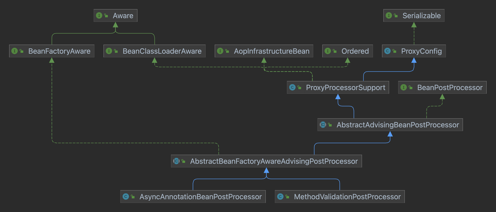

= Application Context
:toc:

== ApplicationContext Interface
ApplicationContext是为应用程序提供配置的中央接口。从类图可以看出，它是BeanFactory的一个子接口，并且添加了Message resource的支持（用于国际化），事件发布等功能组合成一个功能强大的容器。
简单来说，BeanFactory提供配置框架和基本功能，ApplicationContext添加更多企业级应用功能。

image::ApplicationContext.png[]

> An ApplicationContext provides:
>
> - 继承了ListableBeanFactory，拥有访问应用程序组件的能力.
> - 继承了org.springframework.core.io.ResourceLoader，拥有以通用方式加载文件资源的能力。
> - 继承了ApplicationEventPublisher，拥有向注册的侦听器发布事件的能力。
> - 继承了MessageSource，拥有国际化的能力。
> - 继承了HierarchicalBeanFactory，拥有从父上下文继承Definitions的能力，且后代上下文中的BeanDefinition将始终优先。 

ApplicationContext作为一个应用容器。通常，人们会定义服务层对象、持久层对象（例如存储库或数据访问对象 (DAO)）、表示层对象（例如 Web 控制器)、基础设施对象(例如 JPA EntityManagerFactory、JMS 队列)等。而不会在容器中配置细粒度的领域对象，因为创建和加载领域对象通常是存储库和业务逻辑的责任。

== ApplicationContext Implement

AbstractApplicationContext 使用模版方法设计模式，不强制要求用于配置的存储类型,简单地实现了通用的上下文功能。具体的虚拟方法实现由子类完成。

image::AbstractApplicationContext.png[]

> Load or refresh the persistent representation of the configuration, which might be from Java-based configuration, an XML file, a properties file, a relational database schema, or some other format.
>
> As this is a startup method, it should destroy already created singletons if it fails, to avoid dangling resources. In other words, after invocation of this method, either all or no singletons at all should be instantiated.

refresh是容器真正的启动方法，需要做的事情有：

[source,java]
----
// Prepare this context for refreshing.
prepareRefresh();

// Tell the subclass to refresh the internal bean factory.
ConfigurableListableBeanFactory beanFactory = obtainFreshBeanFactory();

// Prepare the bean factory for use in this context.
prepareBeanFactory(beanFactory);

// Allows post-processing of the bean factory in context subclasses.
postProcessBeanFactory(beanFactory);

// Invoke factory processors registered as beans in the context.
invokeBeanFactoryPostProcessors(beanFactory);

// Register bean processors that intercept bean creation.
registerBeanPostProcessors(beanFactory);

// Initialize message source for this context.
initMessageSource();

// Initialize event multicaster for this context.
initApplicationEventMulticaster();

// Initialize other special beans in specific context subclasses.
onRefresh();

// Check for listener beans and register them.
registerListeners();

// Instantiate all remaining (non-lazy-init) singletons.
finishBeanFactoryInitialization(beanFactory);

// Last step: publish corresponding event.
finishRefresh();
----

=== prepareBeanFactory
prepareBeanFactory方法，对BeanFactory进行了配置:

1. 添加了两个 beanPostProcessors, ApplicationContextAwareProcessor（处理各种Aware接口） 和 ApplicationListenerDetector（需要尽早添加，用于发现并注册ApplicationListener）。

2. 注册各种 `Aware` 接口到 ignoredDependencyInterfaces 中，从而忽略它们的 依赖检查（dependency check） 和 自动装配（autowire）。

3. 将BeanFactory和ApplicationContext（没有BeanDefinition的定义）注册到resolvableDependencies。从而使它们可以被自动装配到依赖他们的实例中。

4. 注册4个默认单例（如果当前上下文没有配置）：
- environment 
the Environment bean in the factory.
- systemProperties 
the System properties bean in the factory. See Also: System.getProperties()
- systemEnvironment
the System environment bean in the factory. See Also: System.getenv()
- applicationStartup
the ApplicationStartup bean in the factory.

=== obtainFreshBeanFactory
顾名思义，获取 Bean工厂。obtainFreshBeanFactory中包含两个虚方法：refreshBeanFactory 和 getBeanFactory。由子类完成实现。 比如ClassPathXmlApplicationContext在obtainFreshBeanFactory时，就是在refreshBeanFactory中完成从XML读取BeanDefinition并注册到容器中的。

=== invokeBeanFactoryPostProcessors
和BeanPostProcessor处理的是Bean不同，BeanFactoryPostProcessors是对beanFactory进行处理。容器在invokeBeanFactoryPostProcessors过程中，会从beanFactory查找这个BeanFactoryPostProcessor，并分三个优先级（priorityOrdered， ordered， nonOrdered）依次实例化并执行真正的处理。处理BeanFactoryPostProcessors的顺序非常重要。

比如,我们在容器中配置PropertyPlaceholderConfigurer(它是一个处理占位符替换的BeanFactoryPostProcessor），在下例中，hello这个bean的message的值将使用config.properties配置文件中的配置值。如果这个"hello"对象，也是一个BeanFactoryPostProcessor，那么需要确保它在PropertyPlaceholderConfigurer处理完陈之后再进行处理。所以PropertyPlaceholderConfigurer实现了PriorityOrdered接口（PriorityOrdered objects are always applied before plain Ordered objects regardless of their order values）。

```
<bean id="propertyConfigurer" class="org.springframework.beans.factory.config.PropertyPlaceholderConfigurer">
    <property name="location">
        <value>config.properties</value>
    </property>
</bean>

<bean id="hello" class="org.example.model.Hello">
    <property name="message" value="${hello.example.message}" />
</bean>
```

在这个过程中通过`getBean`实例化的BeanFactoryPostProcessors，容器中只有prepareBeanFactory 过程中主动注册的ApplicationContextAwareProcessor 和 ApplicationListenerDetector 两个BeanPostProcessor。所以其他未注册(要到下一步在进行registerBeanPostProcessors)的 BeanPostProcessors 并不能影响他们。

=== registerBeanPostProcessors
这一步注册所有的 BeanPostProcessors： 

首先，从 beanFactory 中找出 beanPostProcessor 的 definition。BeanPostProcessors 和 上文中的 BeanFactoryPostProcessors 的优先级要求类似，也分为priorityOrdered， ordered， nonOrdered。

然后使用 getBean 获取BeanPostProcessor 实例。

最后， 注册到 beanPostProcessors 列表中。和BeanFactoryPostProcessors不同，BeanPostProcessors还进行了额外的顺序处理，MergedBeanDefinitionPostProcessor会被重新注册一遍（重新注册的目的是往队尾移动），最后ApplicationListenerDetector也会被重新注册一遍，移到队尾。

需要注意！当一个BeanPostProcessor依赖普通的Bean时，这个普通的Bean就可能没法被所有的BeanPostProcessor处理，因为在它初始化的时候，其他优先级稍低的BeanPostProcessor还没有初始化。
所以Spring会在注册其他BeanPostProcessors之前，先注册一个BeanPostProcessorChecker，用来记录（使用info日志）没有被所有BeanPostProcessor处理到Bean实例化过程。

```
// Register BeanPostProcessorChecker that logs an info message when
// a bean is created during BeanPostProcessor instantiation, i.e. when
// a bean is not eligible for getting processed by all BeanPostProcessors.
int beanProcessorTargetCount = beanFactory.getBeanPostProcessorCount() + 1 + postProcessorNames.length;
    beanFactory.addBeanPostProcessor(new BeanPostProcessorChecker(beanFactory, beanProcessorTargetCount));
```

=== registerListeners
从 beanFactory 的找出 ApplicationListener 注册到 EventMulticaster 中。注意，这里注册的是BeanNames，并没有实例化这些bean。

=== finishBeanFactoryInitialization
程序运行到这一步的时候，BeanFactory基本配置完成，所有的BeanPostProessor也准备就绪。

- 冻结所有的beanDefinition，不允许再修改
- 提前加载所有的非lazyInit的单例


=== finishRefresh()
初始化 LifecycleProcessor， 默认 DefaultLifecycleProcessor 实现。并启动所有实现了SmartLifecycle 并且设置成 AutoStartup 的类。

== Container Extension Points

=== BeanPostProcessor

BeanPostProcessor 处理Bean对象，并且只处理BeanPostProcessor所在容器的对象。这意味着在使用层级容器(定义了parent容器)的场景下，BeanPostProcessor对其他容器(父容器或者自容器)的对象是不生效的。

BeanPostProcessor包含两个回调方法,回调发生在属性注入之(populateBean函数执行完成之后),一个在初始化前，一个在初始化后：

1. postProcessBeforeInitialization
+
> Apply this BeanPostProcessor to the given new bean instance before any bean initialization callbacks (like InitializingBean's afterPropertiesSet or a custom init-method). The bean will already be populated with property values. 
+
比如：ApplicationContextAwareProcessor就是在这时，判断实例化的bean是不是EnvironmentAware、EmbeddedValueResolverAware、ResourceLoaderAware、ApplicationEventPublisherAware、MessageSourceAware、ApplicationContextAware、ApplicationStartupAware接口的实例，然后进行相应的Aware回调的。
+
值得注意的是：BeanNameAware、BeanClassLoaderAware、BeanFactoryAware这三个Aware的回调是在invokeAwareMethods方法中执行的，不是通过ApplicationContextAwareProcessor处理的，因为这三个不属于ApplicationContext上下文，而是BeanFactory内置的。这又一次体现了Spring在类和包设计上的优秀之处，值的学习。

2. postProcessAfterInitialization
+
> Apply this BeanPostProcessor to the given new bean instance after any bean initialization callbacks (like InitializingBean's afterPropertiesSet or a custom init-method). The bean will already be populated with property values. 
+
比如：ApplicationListenerDetector就是在这时，通过判断bean对象是不是ApplicationListener的实例，把listener注册到容器中的。

BeanPostProcessor提供了修改bean实例对象的能力。在factory 的 initializeBean 方法中，执行invokeInitMethods前后分别调用applyBeanPostProcessorsBeforeInitialization，applyBeanPostProcessorsAfterInitialization。

> Factory hook that allows for custom modification of new bean instances &mdash; for example, checking for marker interfaces or wrapping beans with proxies.
> An {@code ApplicationContext} can autodetect {@code BeanPostProcessor} beans in its bean definitions and apply those post-processors to any beans subsequently created. A plain {@code BeanFactory} allows for programmatic registration of post-processors, applying them to all beans created through the bean factory.

Spring进行BeanPostProcessor的回调代码如下：

```
protected Object initializeBean(String beanName, Object bean, @Nullable RootBeanDefinition mbd) {
    if (System.getSecurityManager() != null) {
        AccessController.doPrivileged((PrivilegedAction<Object>) () -> {
            invokeAwareMethods(beanName, bean);
            return null;
        }, getAccessControlContext());
    }
    else {
        invokeAwareMethods(beanName, bean);
    }

    Object wrappedBean = bean;
    if (mbd == null || !mbd.isSynthetic()) {
        wrappedBean = applyBeanPostProcessorsBeforeInitialization(wrappedBean, beanName);
    }

    try {
        invokeInitMethods(beanName, wrappedBean, mbd);
    }
    catch (Throwable ex) {
        throw new BeanCreationException(
                (mbd != null ? mbd.getResourceDescription() : null),
                beanName, "Invocation of init method failed", ex);
    }
    if (mbd == null || !mbd.isSynthetic()) {
        wrappedBean = applyBeanPostProcessorsAfterInitialization(wrappedBean, beanName);
    }

    return wrappedBean;
}
```

在ApplicationContext中，BeanPostProcessor是可以被自动发现并注册到容器中的。而BeanFactory没有这个功能，如果单独使用BeanFactory时需要BeanPostProcessor，那么需要通过编程方式注册。这一点可以从上文分析ApplicationContext的refresh函数得知，其中有一步是registerBeanPostProcessors。还有在层级上下文中复制BeanPostProcessor，编程方式注册也会非常有用。

需要注意的是，一些 Spring AOP 基础结构类也是通过实现为BeanPostProcessor，以提供代理包装逻辑。而所有BeanPostProcessor的实例化都是在容器启动的时候就完成的，所以BeanPostProcessor 实例和它们直接引用的 bean，都可能不会被织入AOP逻辑（取决于实例化顺序）。

applyBeanPostProcessorsAfterInitialization除了在initializeBean中对init之后的bean进行处理，还对postProcessBeforeInstantiation返回的代理对象以及FactoryBean返回的Object对象进行处理。即需要对每个初始化的对象，不管通过何种方式初始化的，都要进行处理。


BeanPostProcessor有三个子接口：

==== MergedBeanDefinitionPostProcessor
顾名思义，是对MergedBeanDefinition进行处理。回调的时机是在原始实例创建之后，属性注入之前。比如AutowiredAnnotationBeanPostProcessor就是在postProcessMergedBeanDefinition中去查找AutowiringMetadata的。

> The {@link #postProcessMergedBeanDefinition} method may for example introspect the bean definition in order to prepare some cached metadata before post-processing actual instances of a bean. It is also allowed to modify the bean definition but <i>only</i> for definition properties which are actually intended for concurrent modification. Essentially, this only applies to operations defined on the {@link RootBeanDefinition} itself but not to the properties of its base classes.

==== DestructionAwareBeanPostProcessor
销毁bean的时候进行处理。AbstractAutowireCapableBeanFactory在创建了bean之后，会尝试去注册DisposableBean。注册时主要将拥有销毁方法的单例bean进行DisposableBeanAdapter适配，然后注册到单例注册器的disposableBeans中。

> The typical usage will be to invoke custom destruction callbacks on specific bean types, matching corresponding initialization callbacks.

==== InstantiationAwareBeanPostProcessor
在createBean的分析中已经得知，BeanFactory会在doCreateBean之前，给iabpp一个机会，通过TargetSources返回一个代理对象。它就是调用postProcessBeforeInstantiation来完成这项工作的。

> Typically used to suppress default instantiation for specific target beans, for example to create proxies with special TargetSources (pooling targets, lazily initializing targets, etc), or to implement additional injection strategies such as field injection.

同时，它还能在属性注入前修改bean的状态，并控制是否注入属性（postProcessAfterInstantiation返回false就不进行属性注入）。以及通过postProcessProperties和postProcessPropertyValues两个方法对将要注入的PropertyValues进行处理。
再以 AutowiredAnnotationBeanPostProcessor 为例，就是在postProcessProperties中，将查找到的AutowiringMetadata注入到bean中的。

该接口还存在一个子接口：SmartInstantiationAwareBeanPostProcessor。

> adding a callback for predicting the eventual type of a processed bean.

除了预判返回的bean类型，它还在创建bean原始实例时尝试从候选构造函数列表中选定一个构造函数。
以及为了解决循环依赖获取提前暴露的bean。如果一个对象提前获取过一次，就会将它放到earlyProxyReferences缓存中。aop过程中，就是通过在postProcessAfterInitialization中检查对象是不是在缓存中来避免重复要调用wrapIfNecessary（aop实现中的getEarlyBeanReference方法同样调用了wrapIfNecessary）。


=== BeanFactoryPostProcessor

如果需要对BeanDefinition元数据进行更改，那么相应的扩展是BeanFactoryPostProcessor。

> The semantics of this interface are similar to those of the BeanPostProcessor, with one major difference: BeanFactoryPostProcessor operates on the bean configuration metadata. 

从上文中对 invokeBeanFactoryPostProcessors 的分析可知,BeanFactoryPostProcessor也是可以被自动发现并注册到容器中的。
ApplicationContext 允许 BeanFactoryPostProcessor 读取元配置数据(BeanDifinition)，并在实例化之前修改它们。和BeanPostProcessor 一样，它也只处理所在容器的对象，不影响层级中其他容器。

比如：PropertyPlaceholderConfigurer， 就是基于这个扩展点，对BeanDefinition中存在的占位符进行替换的。不过PropertyPlaceholderConfigurer已经被标记为 Deprecated。Spring 建议使用 PropertySourcesPlaceholderConfigurer 代替，不过它属于context包下，具有环境感知能力，从而可以为不同的环境提供配置信息。

=== FactoryBean

对于复杂的Bean创建过程，可以使用FactoryBean进行扩展。

如果需要获取FactoryBean本身，可以在id前添加 & : `getBean("&myBean")` 。

=== Example

==== Annotation-based Container Configuration

Spring中基于注解的配置，就是通过一系列Bean(Factory)PostProcessors实现的。Spring还提供了快捷方式帮助开发人员快速注册这些BeanPostProcessors。

```
<?xml version="1.0" encoding="UTF-8"?>
<beans xmlns="http://www.springframework.org/schema/beans"
	xmlns:xsi="http://www.w3.org/2001/XMLSchema-instance"
	xmlns:context="http://www.springframework.org/schema/context"
	xsi:schemaLocation="http://www.springframework.org/schema/beans
		https://www.springframework.org/schema/beans/spring-beans.xsd
		http://www.springframework.org/schema/context
		https://www.springframework.org/schema/context/spring-context.xsd">

	<context:annotation-config/>

</beans>
```

其中的 `<context:annotation-config/>` 元素隐式注册以下后处理器(元素的解析由ContextNamespaceHandler处理)：

- ConfigurationClassPostProcessor(internalConfigurationAnnotationProcessor)。这是一个BeanFactoryPostProcessor, 处理 `@Configuration` 注解，如果有 `@Bean` 注解的方法（即使类上没有配置 `@Configuration` ）也会被识别到。然后通过 ConfigurationClassBeanDefinitionReader 从被注解的类中加载配置信息并注册到 BeanDefinitionRegistry 中。
- AutowiredAnnotationBeanPostProcessor(internalAutowiredAnnotationProcessor)。这是一个BeanPostProcessor, 我们常用的 `@Autowired` `@Value` 两个注解就是由它进行处理。也支持 JSR-330's `@Inject` （这个注解可以用来替换 `@Autowired` ）
- CommonAnnotationBeanPostProcessor(internalCommonAnnotationProcessor)。 这也是一个BeanPostProcessor， `@Resource`  `@PostConstruct`  `@PreDestroy` 等注解都由它处理。
+
> supports common Java annotations out of the box, in particular the JSR-250 annotations in the javax.annotation package. 

- EventListenerMethodProcessor(internalEventListenerProcessor)。 这是一个 BeanFactoryPostProcessor ，处理 `@EventListener`
- PersistenceAnnotationBeanPostProcessor(internalPersistenceAnnotationProcessor)。处理JPA注解（if jpa present）。


==== AbstractAdvisingBeanPostProcessor

Spring通过三级缓存很好地解决了大多数场景的循环依赖问题，但是工作中有时也会遇到因为循环依赖失败的问题。最常见的就是使用了 `@Async` 或者 `@Validated` 注解的情况。



这两个注解的解析，分别是通过 AsyncAnnotationBeanPostProcessor 和 MethodValidationPostProcessor 来处理的。它们是AbstractBeanFactoryAwareAdvisingPostProcessor的子类，AbstractBeanFactoryAwareAdvisingPostProcessor 又是 AbstractAdvisingBeanPostProcessor的子类。
这一簇的BeanPostProcessor处理逻辑是，在初始化这个BeanPostProcessor时构造一个Advisor（包含Advice 和 PointCut）,注册到BeanPostProcessors队列中。
当后续有Bean对象创建时，这个bpp 就会在 postProcessAfterInitialization 检测当前对象是否能被PointCut切到，如果可以，就使用proxyFactory创建代理对象。

以AsyncAnnotationBeanPostProcessor为例，它创建了一个类和方法上注解 `@Async` 或者 `@javax.ejb.Asynchronous` 的 AnnotationMatchingPointcut 组合而成的 ComposablePointcut。

```
protected Pointcut buildPointcut(Set<Class<? extends Annotation>> asyncAnnotationTypes) {
    ComposablePointcut result = null;
    for (Class<? extends Annotation> asyncAnnotationType : asyncAnnotationTypes) {
        Pointcut cpc = new AnnotationMatchingPointcut(asyncAnnotationType, true);
        Pointcut mpc = new AnnotationMatchingPointcut(null, asyncAnnotationType, true);
        if (result == null) {
            result = new ComposablePointcut(cpc);
        }
        else {
            result.union(cpc);
        }
        result = result.union(mpc);
    }
    return (result != null ? result : Pointcut.TRUE);
}
```

但对于循环依赖的场景，被AOP代理的对象，需要提前暴露出去。以ObjectFactory的形式放在singletonFactories缓存中，在循环引用发生的时候，会应用所有的 SmartInstantiationAwareBeanPostProcessor ，此时如果需要自动代理，就会提前获取到代理对象。AbstractAutoProxyCreator 实现了自动代理的基本功能。然而 AsyncAnnotationBeanPostProcessor 和 MethodValidationPostProcessor 不是 SmartInstantiationAwareBeanPostProcessor, 而是普通的 BeanPostProcessor， 从而在循环依赖发生时，不会提前获取到自动代理对象。

设有A B两个对象相互循环依赖，A中某个方法标记了 `@Async`, 当初始化A时，会将 ObjectFactory(lambda表达式 `() -> getEarlyBeanReference(beanName, mbd, bean)`) 放入singletonFactories, 进行DI时，因为依赖了B对象，于是初始化B。
在对B进行依赖注入时，获取依赖对象时，就会执行getEarlyBeanReference方法，并将返回的Bean对象（因为没有 SmartInstantiationAwareBeanPostProcessor 所以返回的是原对象）放入 earlySingletonObjects（二级缓存） 中。此时B中注入的就是A的原始对象。完成B的初始化后，A的属性注入(populateBean)继续执行并直到完成后，开始执行 initializeBean。此时 AsyncAnnotationBeanPostProcessor 会被应用，从而得到一个A的代理对象。在最后初始化完成后，Spring会检查提前暴露的单例对象(earlySingletonReference),因为发生了循环依赖，获取所以在earlySingletonObjects存在被依赖的对象（A的原始对象），但是真正暴露的对象（exposedObject）是一个代理对象，此时就发生了不一致的情况，Spring就会抛一个 BeanCurrentlyInCreationException 异常：

```
Bean with name 'a' has been injected into other beans [b] in its raw version as part of a circular reference, but has eventually been wrapped.
``` 

整理清楚异常产生的过程，我们就可以选择对应的措施。一个相对简单的应对方法是让B在A之前初始化。

```
<bean id="a" class="org.example.model.ClassA" depends-on="b"/>
<bean id="b" class="org.example.model.ClassB" />
```

通过以上配置，Spring会先初始化b对象，然后在初始化a的时候，a会去获取b的提前暴露对象，但b不会发生提前暴露对象和最终暴露的对象不一致的情况，于是a的属性注入成功，然后a继续init，并应用 AsyncAnnotationBeanPostProcessor 返回一个AOP代理对象，注入到b对象中。
从原理可知，这种解决方案只适用于 a b 只存在一个有 @Async 注解的情况。不过两个循环依赖的对象，同时又都存在 @Async 或者 @Validated 注解的情况相对很少见。

=== Summary

首先，spring工程启动时,在obtainFreshBeanFactory方法中，准备好一个进行基本配置的BeanFactory。

如果使用GenericApplicationContext，那么需要以编程方式将一些基础配置设置到BeanFactory中。SpringBoot的web工程，默认情况下使用AnnotationConfigServletWebServerApplicationContext，它继承自GenericApplicationContext，在构造时会注册 AnnotationConfigProcessors 和 其他一些BeanFactoryBeanPostProcessors。

如果使用ClassPathXmlApplicationContext,则需要在XML文件中进行配置，Spring会在obtainFreshBeanFactory的时候，从XML加载配置的BeanDefinition。


上述准备工作完成后，就说明扩展点都配置好了。接下来就是Spring怎么支持这些扩展点的。


1. BeanFactoryPostProcessor.postProcessBeanFactory 
+
在ApplicationContext启动时(refresh方法中的invokeBeanFactoryPostProcessors)。BeanFactoryPostProcessor 只有一个方法 postProcessBeanFactory，所以只有此处会应用。
+
此时可以修改BeanDefition的元数据,如占位符替换等。
+
也可以追加BeanDefinition，比如ConfigurationClassPostProcessor,解析配置注解类，比如 `@Bean` 注解。如果配置了 `@ComponentScan` 注解，还会执行扫描。然后构建BeanDefition注册到容器中。
+
注意，如果是通过XML配置 `<context:component-scan base-package="org.example" />` 进行扫描，它不是通过BeanFactoryPostProcessor处理的。而是在DefinitionReader中处理的。可见，BeanDefinition的追加可以很灵活，但是越靠前越好，因为Spring在refresh的时候 通过getBean 初始化BeanFactoryPostProcessor 和 BeanPostProcessor 。如果在这之后再注册 PostProcessor 的 BeanDefinition，那此扩展点可能不会生效。 

2. InstantiationAwareBeanPostProcessor.postProcessBeforeInstantiation
+
在CreateBean函数中，doCreateBean之前调用，允许返回一个代理对象代替目标对象。
+
这个扩展点一般在框架内部使用。
+
> NOTE: This interface is a special purpose interface, mainly for internal use within the framework. It is recommended to implement the plain BeanPostProcessor interface as far as possible.

3. MergedBeanDefinitionPostProcessor.postProcessMergedBeanDefinition
+
在createBeanInstance得到instanceWrapper之后调用, 修改merged bean definition。 
+
比如：CommonAnnotationBeanPostProcessor 和 AutowiredAnnotationBeanPostProcessor 都是在此时去查找InjectionMetadata，放入 injectionMetadataCache 缓存，并将这些信息注册到BeanDefinition的externallyManagedConfigMembers中，以备后用。（注意：这里修改的是MergedBeanDefinition, 而不是占位符替换时修改的BeanDefnition元数据）。

4. InstantiationAwareBeanPostProcessor.postProcessAfterInstantiation 
+
在populateBean方法中，正式开始属性注入之前调用。
+
> Give any InstantiationAwareBeanPostProcessors the opportunity to modify the state of the bean before properties are set. This can be used, for example, to support styles of field injection.

5. InstantiationAwareBeanPostProcessor.postProcessProperties
+
提供额外的属性注入能力。
+
> Post-process the given property values before the factory applies them to the given bean, without any need for property descriptors.
+ 
比如：CommonAnnotationBeanPostProcessor 和 AutowiredAnnotationBeanPostProcessor, 此时就时使用在步骤3收集的InjectionMetadata，调用InjectionMetadata.inject 完成属性注入。

6. BeanPostProcessor.postProcessBeforeInitialization
+
在属性注入后，初始化开始之前。比如：ApplicationContextAwareProcessor 就是在此时，调用ApplicationContext相关的Aware接口。
CommonAnnotationBeanPostProcessor 继承自InitDestroyAnnotationBeanPostProcessor 也是在此时，调用注解了 `@PostConstruct` 的方法进行Bean的初始化。然后再进行invokeInitMethods方法的逻辑。

7. BeanPostProcessor.postProcessAfterInitialization
+
在初始化完成之后。比如：AbstractAutoProxyCreator就是在此时进行自动代理的。

8. SmartInstantiationAwareBeanPostProcessor.getEarlyBeanReference
+
只有当出现循环依赖时，`getSingleton` 方法会触发 AbstractAutowireCapableBeanFactory.getEarlyBeanReference ,从而应用 SmartInstantiationAwareBeanPostProcessors。

可以发现，大部分的扩展点都作用在创建Bean对象的时候。
