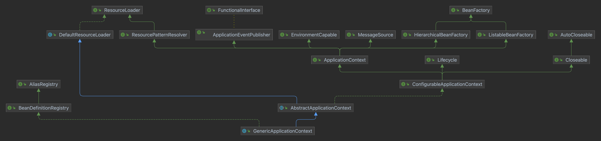

### ApplicationContext
是为应用程序提供配置的中央接口。从类图可以看出，它通过继承其他接口，组合成一个功能强大的容器。

> Central interface to provide configuration for an application.
An ApplicationContext provides:
>
> - Bean factory methods for accessing application components. Inherited from ListableBeanFactory.
> - The ability to load file resources in a generic fashion. Inherited from the org.springframework.core.io.ResourceLoader interface.
> - The ability to publish events to registered listeners. Inherited from the ApplicationEventPublisher interface.
> - The ability to resolve messages, supporting internationalization. Inherited from the MessageSource interface.
> - Inheritance from a parent context. Definitions in a descendant context will always take priority. This means, for example, that a single parent context can be used by an entire web application, while each servlet has its own child context that is independent of that of any other servlet.

### AbstractApplicationContext
使用模版方法设计模式，简单地实现了通用的上下文功能。其中 refresh() 是启动方法。

> Load or refresh the persistent representation of the configuration, which might be from Java-based configuration, an XML file, a properties file, a relational database schema, or some other format.
>
> As this is a startup method, it should destroy already created singletons if it fails, to avoid dangling resources. In other words, after invocation of this method, either all or no singletons at all should be instantiated.

refresh需要做的事情有：

[,java]
----
// Prepare this context for refreshing.
prepareRefresh();

// Tell the subclass to refresh the internal bean factory.
ConfigurableListableBeanFactory beanFactory = obtainFreshBeanFactory();

// Prepare the bean factory for use in this context.
prepareBeanFactory(beanFactory);

// Allows post-processing of the bean factory in context subclasses.
postProcessBeanFactory(beanFactory);

// Invoke factory processors registered as beans in the context.
invokeBeanFactoryPostProcessors(beanFactory);

// Register bean processors that intercept bean creation.
registerBeanPostProcessors(beanFactory);

// Initialize message source for this context.
initMessageSource();

// Initialize event multicaster for this context.
initApplicationEventMulticaster();

// Initialize other special beans in specific context subclasses.
onRefresh();

// Check for listener beans and register them.
registerListeners();

// Instantiate all remaining (non-lazy-init) singletons.
finishBeanFactoryInitialization(beanFactory);

// Last step: publish corresponding event.
finishRefresh();
----

#### prepareBeanFactory()
添加一些 beanPostProcessors :
- ApplicationContextAwareProcessor
- ApplicationListenerDetector

还会定义一些忽略依赖的class（ignoredDependencyInterfaces）

设置不在beanfactory中维护的可自动注入的对象（resolvableDependencies）:

注册几个默认单例：
- ENVIRONMENT_BEAN_NAME
- SYSTEM_PROPERTIES_BEAN_NAME
- SYSTEM_ENVIRONMENT_BEAN_NAME
- APPLICATION_STARTUP_BEAN_NAME

#### registerBeanPostProcessors()
从 beanFactory 的找出 beanPostProcessor 的 definition，并 getBean 设置到 beanPostProcessors 列表中

#### initApplicationEventMulticaster()
初始化事件广播器（EventMulticaster）

#### registerListeners()
从 beanFactory 的找出 ApplicationListener 注册到 EventMulticaster 中

#### finishBeanFactoryInitialization()
- 冻结所有的beanDefinition，不允许再修改
- 提前加载所有的非lazyInit的单例

#### finishRefresh()
初始化 LifecycleProcessor， 默认 DefaultLifecycleProcessor 实现。并启动所有实现了SmartLifecycle 并且设置成 AutoStartup 的类。

