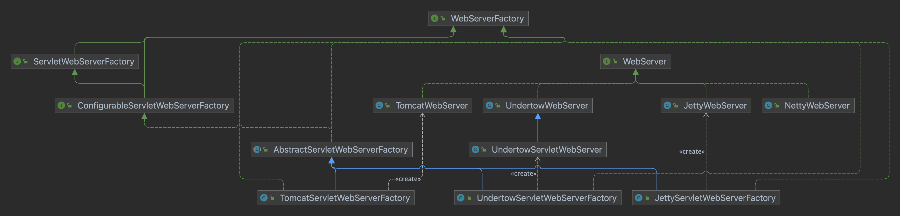

# Springboot Web启动

Springboot Web项目，通过main方法中调用SpringApplication的静态run方法，传入primarySource（@SpringBootApplication注解的主类）进行启动。

启动的工作就是构造一个SpringApplicatin，并且运行它。

```
new SpringApplication(primarySources).run(args);
```

## 1. 构建SpringApplication

SpringApplicatin 构造的时候，通过 `WebApplicationType.deduceFromClasspath()` 确定 WebApplicationType.
```
/**
* The application should not run as a web application and should not start an
* embedded web server.
*/
NONE,

/**
* The application should run as a servlet-based web application and should start an
* embedded servlet web server.
*/
SERVLET,

/**
* The application should run as a reactive web application and should start an
* embedded reactive web server.
*/
REACTIVE;
```

通过spring-boot-starter-web配置的servlet项目，会在classpath中包含`jakarta.servlet.Servlet`和`org.springframework.web.context.ConfigurableWebApplicationContext`两个类，并且不会包含reactive相关的类，所以会判定为SERVLET。


然后通过SpringFactoriesLoader初始化两个集合：

```
List<ApplicationContextInitializer<?>> initializers;
List<ApplicationListener<?>> listeners;
```

## 2. 启动SpringApplicatin

### 2.1 构建ApplicationContext

启动过程中，由ApplicationContextFactory通过不同的WebApplicationType创建相应的ApplicationContext


```
private <T> T getFromSpringFactories(WebApplicationType webApplicationType,
		BiFunction<ApplicationContextFactory, WebApplicationType, T> action, Supplier<T> defaultResult) {
	for (ApplicationContextFactory candidate : SpringFactoriesLoader.loadFactories(ApplicationContextFactory.class,
			getClass().getClassLoader())) {
		T result = action.apply(candidate, webApplicationType);
		if (result != null) {
			return result;
		}
	}
	return (defaultResult != null) ? defaultResult.get() : null;
}
```

SERVLET类型的项目Spring会初始化一个AnnotationConfigServletWebServerApplicationContext。


AnnotationConfigServletWebServerApplicationContext在构造的时候，会初始化一个reader（AnnotatedBeanDefinitionReader）和一个scanner（ClassPathBeanDefinitionScanner）

AnnotatedBeanDefinitionReader在初始化的时候，会向registry(GenericApplicationContext本身就是一个BeanDefinitionRegistry)注册处理注解配置相关的Processors：

- ConfigurationClassPostProcessor
- AutowiredAnnotationBeanPostProcessor
- CommonAnnotationBeanPostProcessor
- PersistenceAnnotationBeanPostProcessor
- EventListenerMethodProcessor
- DefaultEventListenerFactory

构造完ApplicationContext后，需要做一些准备工作：

在prepareContext方法中，其中的一项工作就是 `Load beans into the application context.` 。 为了完成这个工作，springboot定义了一个 BeanDefinitionLoader。

----
Loads bean definitions from underlying sources, including XML and JavaConfig. 
Acts as a simple facade over AnnotatedBeanDefinitionReader, XmlBeanDefinitionReader and ClassPathBeanDefinitionScanner.
----

完成准备工作后，执行 refreshContext ，ApplicationContext 调用自己的refresh方法进行工作。

### 2.2 启动WebServer

ServletWebServerApplicationContext 重写了onfresh函数，通过WebServerFactory创建WebServer。




