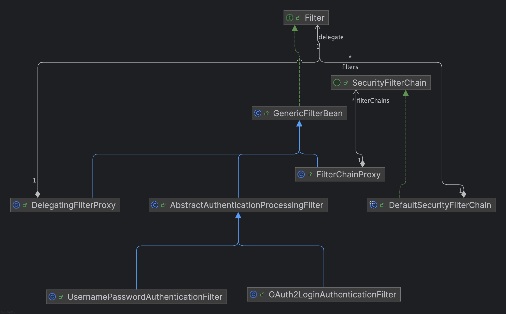

Spring Security’s Servlet support is based on Servlet Filters.


Spring provides a Filter implementation named DelegatingFilterProxy that allows bridging between the Servlet container’s lifecycle and Spring’s ApplicationContext.

FilterChainProxy is a special Filter provided by Spring Security that allows delegating to many Filter instances through SecurityFilterChain. Since FilterChainProxy is a Bean, it is typically wrapped in a DelegatingFilterProxy.

SecurityFilterChain is used by FilterChainProxy to determine which Spring Security Filter instances should be invoked for the current request.

The Security Filters in SecurityFilterChain are typically Beans, but they are registered with FilterChainProxy instead of DelegatingFilterProxy.
These security filters are most often declared using an HttpSecurity instance.

```
@Configuration
@EnableWebSecurity
public class SecurityConfig {

    @Bean
    @Order(1)
    SecurityFilterChain apiSecurity(HttpSecurity http) throws Exception {
        http
            .securityMatcher("/api/**")
            .authorizeHttpRequests(auth -> auth
                .anyRequest().authenticated()
            )
            .oauth2ResourceServer(oauth2 -> oauth2
                .jwt(Customizer.withDefaults())
            );
    
        return http.build();
    }
    
    @Bean
    @Order(2)
    SecurityFilterChain webSecurity(HttpSecurity http) throws Exception {
        http
            .securityMatcher("/**")
            .authorizeHttpRequests(auth -> auth
                .anyRequest().authenticated()
            )
            .formLogin(Customizer.withDefaults())
            .oauth2Login(Customizer.withDefaults());
    
        return http.build();
    }

}
```

Spring Security配置，就是构造 SecurityFilterChain，从而在http过程中按一定顺序（具体顺序 {@link org.springframework.security.config.annotation.web.builders.FilterOrderRegistration}）插入一组filter。

```
                       FilterChainProxy
                              │
                ┌─────────────┴─────────────┐
                │                           │
           /api/**                        /**
                │                           │
                ▼                           ▼
       API SecurityChain            Web SecurityChain
                │                           │
       OAuth2 Resource Server       Form Login
                │                   OAuth2 Login / OIDC
                ▼                           │
             JWT                       Session
```

从对象结构上看 DelegatingFilterProxy 包含 一个 FilterChainProxy。
FilterChainProxy 含一组 SecurityFilterChain。
每个 SecurityFilterChain 含一组 Security Filters，比如：UsernamePasswordAuthenticationFilter。




