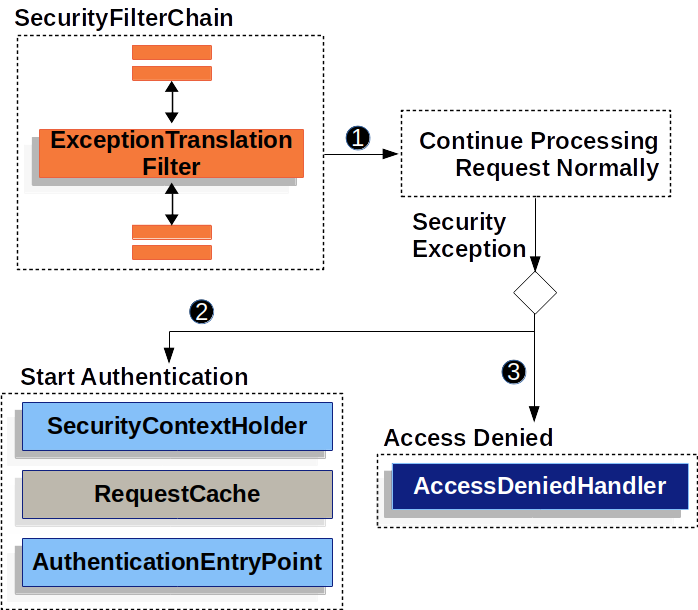
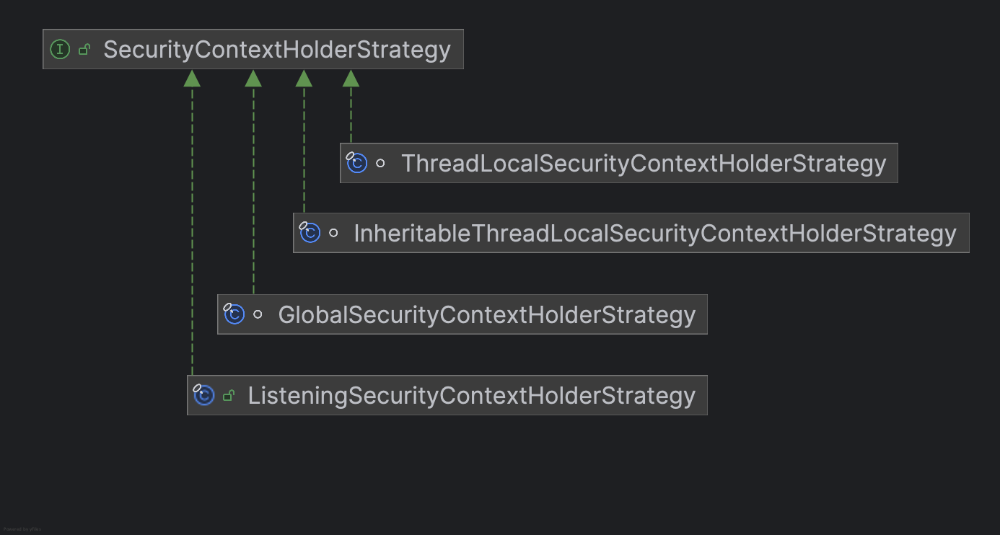
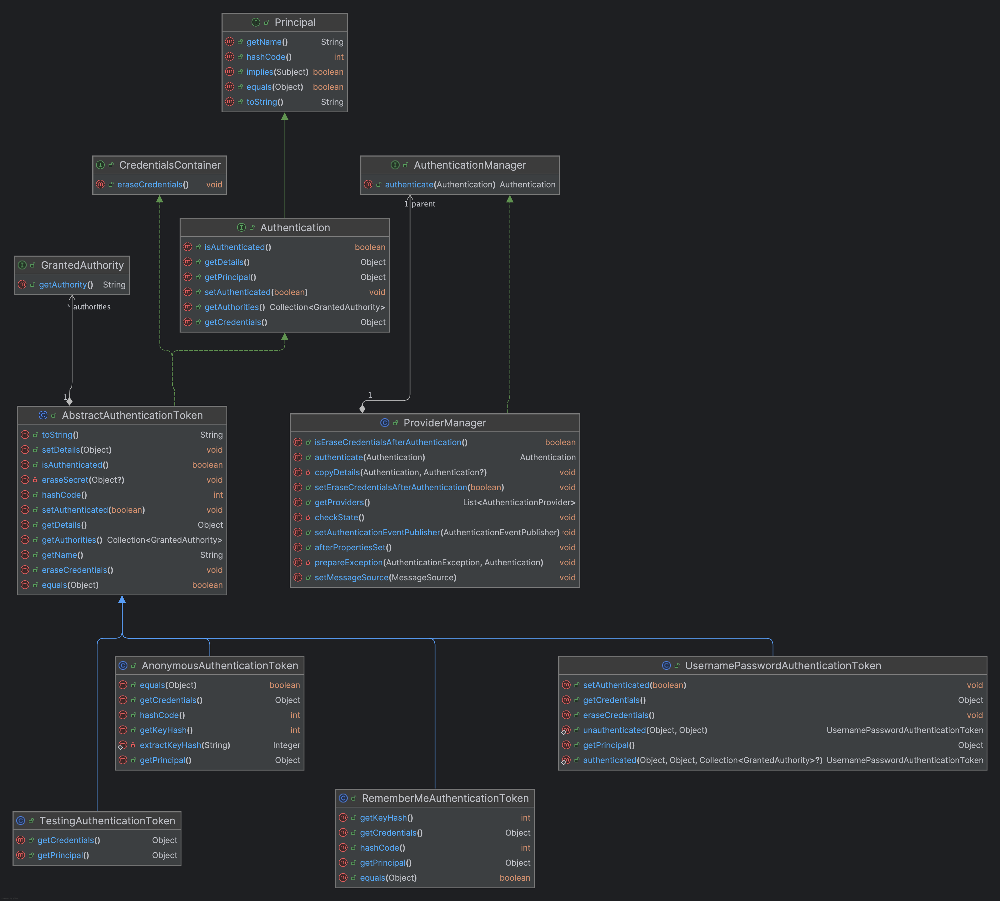
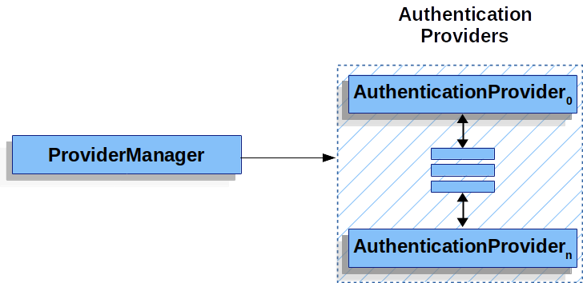
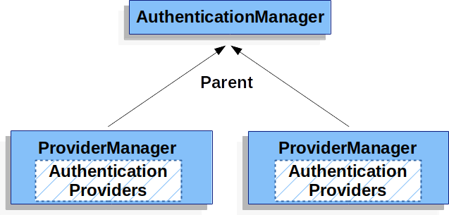
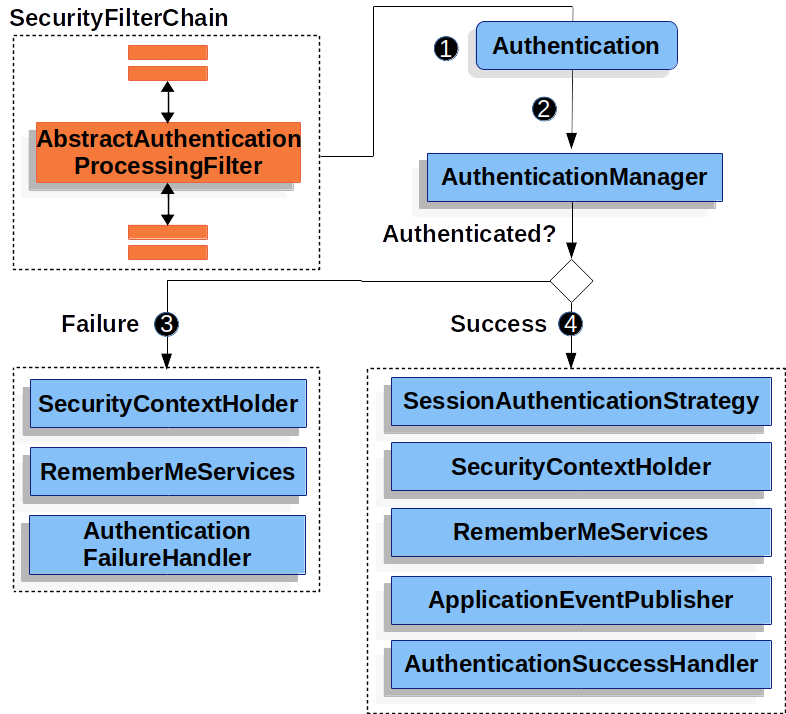
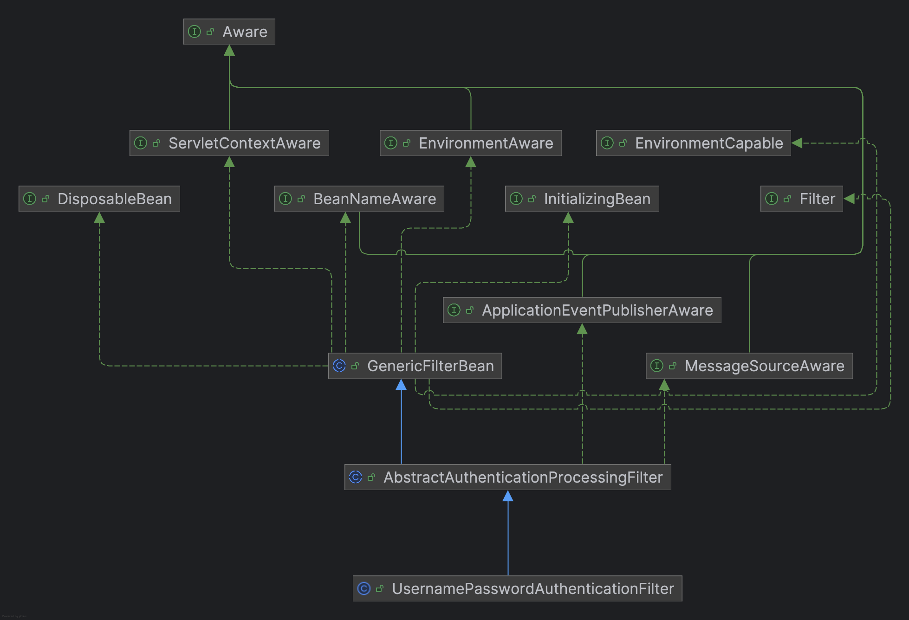
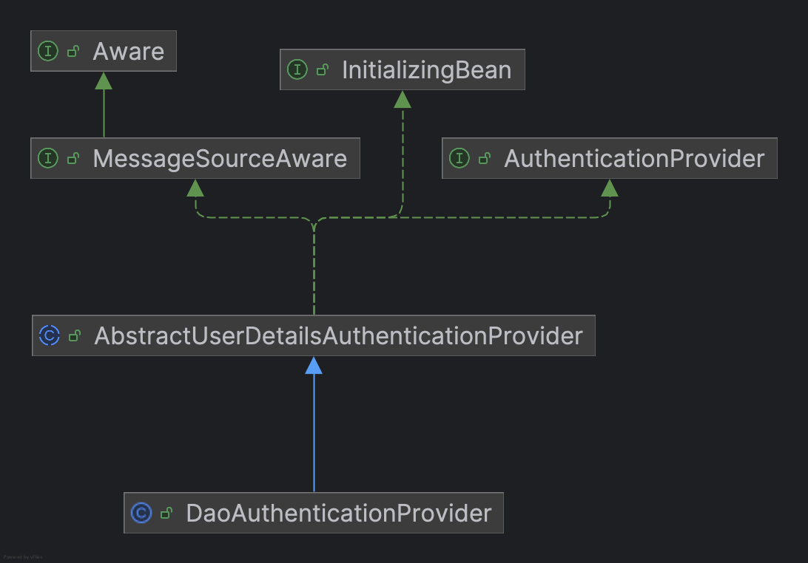
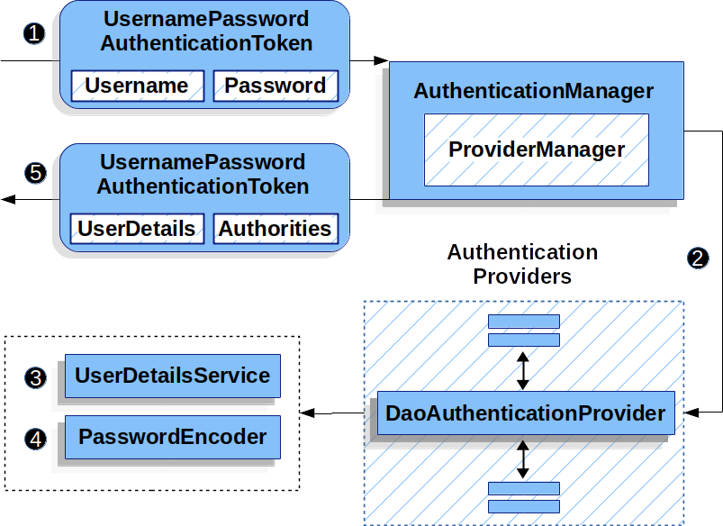
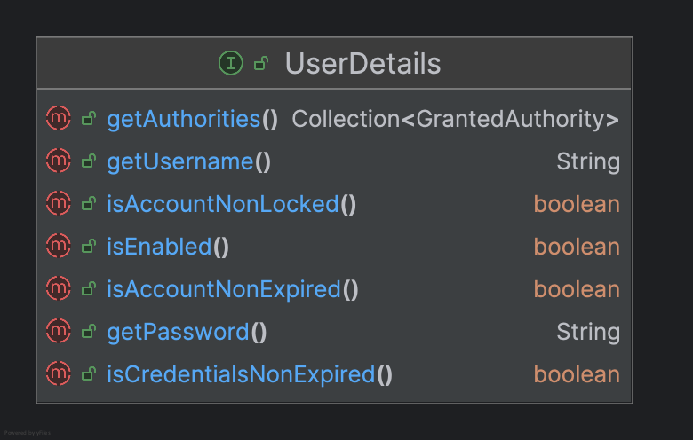

## Architecture


## Authentication
###  SecurityContextHolder

> The SecurityContextHolder is where Spring Security stores the details of who is authenticated.

This class provides a series of static methods that delegate to an instance of SecurityContextHolderStrategy. The purpose of the class is to provide a convenient way to specify the strategy that should be used for a given JVM. This is a JVM-wide setting, since everything in this class is static to facilitate ease of use in calling code.


> You can configure SecurityContextHolder with a strategy on startup to specify how you would like the context to be stored.



By default，`MODE_THREADLOCAL` is used.

The SecurityContext is obtained from the SecurityContextHolder. The SecurityContext contains an Authentication object.



The Authentication interface serves two main purposes within Spring Security:
- 作为 `AuthenticationManager` 的输入。
  > An input to AuthenticationManager to provide the credentials a user has provided to authenticate. When used in this scenario, isAuthenticated() returns false.
- 表示当前已通过身份验证的用户.
  > Represent the currently authenticated user. You can obtain the current Authentication from the SecurityContext.

The Authentication contains:

- 主体（用户身份），需要被认证的实体。不用 user，而用 principal 是因为在安全体系中，并不只有“人类用户”才需要认证。
  Spring Security 是基于 Java Security Model 设计的，而 Java 的安全模型规定：`Authentication = principal + credentials`;
  > principal: Identifies the user. When authenticating with a username/password this is often an instance of UserDetails.

- 凭证，用来证明“你是你”的敏感信息。如：密码，JWT，OAuth2AuthorizationCode等。大部分情况下，认证成功后 Spring Security 会自动把 credentials 清空（避免泄露）
  > credentials: Often a password. In many cases, this is cleared after the user is authenticated, to ensure that it is not leaked.
  
- 权限，代表当前用户拥有哪些权限或角色。通过 `Collection<? extends GrantedAuthority> getAuthorities();` 方法，得到 GrantedAuthority 集合。
  如：ROLE_ADMIN（角色），order:read（权限），自定义权限-任何字符串都可以。当使用用户名密码认证时，GrantedAuthority 实例列表通常由 UserDetailsService 加载。
  > authorities: The GrantedAuthority instances are high-level permissions the user is granted. Two examples are roles and scopes.
  
### AuthenticationManager
> AuthenticationManager is the API that defines how Spring Security’s Filters perform authentication.

#### ProviderManager
> ProviderManager is the most commonly used implementation of AuthenticationManager.
> ProviderManager delegates to a List of AuthenticationProvider instances. 
> Each AuthenticationProvider has an opportunity to indicate that authentication should be successful, fail, or indicate it cannot make a decision and allow a downstream AuthenticationProvider to decide.



ProviderManager also allows configuring an optional parent AuthenticationManager.
In fact, multiple ProviderManager instances might share the same parent AuthenticationManager.



### AuthenticationProvider

> You can inject multiple AuthenticationProvider instances into ProviderManager.

比较常用的有： DaoAuthenticationProvider 用于基于用户名密码的认证，JwtAuthenticationProvider 支持 JWT token。

### AuthenticationEntryPoint

AuthenticationEntryPoint is used to send an HTTP response that requests credentials from a client.

比如:
- BasicAuthenticationEntryPoint
要求使用httpBasic认证
```java
@Override
public void commence(HttpServletRequest request, HttpServletResponse response,
        AuthenticationException authException) throws IOException {
    response.setHeader("WWW-Authenticate", "Basic realm=\"" + this.realmName + "\"");
    response.sendError(HttpStatus.UNAUTHORIZED.value(), HttpStatus.UNAUTHORIZED.getReasonPhrase());
}
```
- LoginUrlAuthenticationEntryPoint
跳转到一个登录页
```java
@Override
public void commence(HttpServletRequest request, HttpServletResponse response,
        AuthenticationException authException) throws IOException, ServletException {
    if (!this.useForward) {
        // redirect to login page. Use https if forceHttps true
        String redirectUrl = buildRedirectUrlToLoginPage(request, response, authException);
        this.redirectStrategy.sendRedirect(request, response, redirectUrl);
        return;
    }
    String redirectUrl = null;
    if (this.forceHttps && "http".equals(request.getScheme())) {
        // First redirect the current request to HTTPS. When that request is received,
        // the forward to the login page will be used.
        redirectUrl = buildHttpsRedirectUrlForRequest(request);
    }
    if (redirectUrl != null) {
        this.redirectStrategy.sendRedirect(request, response, redirectUrl);
        return;
    }
    String loginForm = determineUrlToUseForThisRequest(request, response, authException);
    logger.debug(LogMessage.format("Server side forward to: %s", loginForm));
    RequestDispatcher dispatcher = request.getRequestDispatcher(loginForm);
    dispatcher.forward(request, response);
    return;
}
```

## AbstractAuthenticationProcessingFilter





1. 用户提交凭证，AbstractAuthenticationProcessingFilter 从 HttpServletRequest 创建一个 Authentication 实例，具体实现依赖 AbstractAuthenticationProcessingFilter 的子类。
     ```
     /**
	 * Performs actual authentication.
	 * <p>
	 * The implementation should do one of the following:
	 * <ol>
	 * <li>Return a populated authentication token for the authenticated user, indicating
	 * successful authentication</li>
	 * <li>Return null, indicating that the authentication process is still in progress.
	 * Before returning, the implementation should perform any additional work required to
	 * complete the process.</li>
	 * <li>Throw an <tt>AuthenticationException</tt> if the authentication process
	 * fails</li>
	 * </ol>
	 * @param request from which to extract parameters and perform the authentication
	 * @param response the response, which may be needed if the implementation has to do a
	 * redirect as part of a multi-stage authentication process (such as OIDC).
	 * @return the authenticated user token, or null if authentication is incomplete.
	 * @throws AuthenticationException if authentication fails.
	 */
	 public abstract Authentication attemptAuthentication(HttpServletRequest request, HttpServletResponse response)
			throws AuthenticationException, IOException, ServletException;
     ```
   比如：`UsernamePasswordAuthenticationFilter` 会创建一个 `UsernamePasswordAuthenticationToken`。
    ```
   	@Override
	public Authentication attemptAuthentication(HttpServletRequest request, HttpServletResponse response)
			throws AuthenticationException {
		if (this.postOnly && !request.getMethod().equals("POST")) {
			throw new AuthenticationServiceException("Authentication method not supported: " + request.getMethod());
		}
		String username = obtainUsername(request);
		username = (username != null) ? username.trim() : "";
		String password = obtainPassword(request);
		password = (password != null) ? password : "";
		UsernamePasswordAuthenticationToken authRequest = UsernamePasswordAuthenticationToken.unauthenticated(username,
				password);
		// Allow subclasses to set the "details" property
		setDetails(request, authRequest);
		return this.getAuthenticationManager().authenticate(authRequest);
	}
    ```
2. 然后，身份验证信息会传递给身份验证管理器进行验证。
3. 如果认证失败
   - 清除 SecurityContextHolder
   - 调用 RememberMeServices.loginFail
   - 调用 AuthenticationFailureHandler
4. 如果认证成功
   - SessionAuthenticationStrategy 收到新的登录通知
   - 从 SecurityContextHolder 加载已认证的 Authentication，并将 authorities 添加到返回的 Authentication.
   - 调用 RememberMeServices.loginSuccess
   - ApplicationEventPublisher 发布 InteractiveAuthenticationSuccessEvent 事件
   - 调用 AuthenticationSuccessHandler

### Username/Password

用户名密码的认证方式是最常见的，Spring对此提供了全面的支持。

AbstractUserDetailsAuthenticationProvider 提供和 UserDetails 工作的能力。
通过 UserDetailsService 查询用户。
支持 UsernamePasswordAuthenticationToken。

> A base AuthenticationProvider that allows subclasses to override and work with UserDetails objects.



DaoAuthenticationProvider 通过 UserDetailsService 获取 UserDetails



```java
@Override
protected final UserDetails retrieveUser(String username, UsernamePasswordAuthenticationToken authentication)
        throws AuthenticationException {
    prepareTimingAttackProtection();
    try {
        UserDetails loadedUser = this.getUserDetailsService().loadUserByUsername(username);
        if (loadedUser == null) {
            throw new InternalAuthenticationServiceException(
                    "UserDetailsService returned null, which is an interface contract violation");
        }
        return loadedUser;
    }
    catch (UsernameNotFoundException ex) {
        mitigateAgainstTimingAttack(authentication);
        throw ex;
    }
    catch (InternalAuthenticationServiceException ex) {
        throw ex;
    }
    catch (Exception ex) {
        throw new InternalAuthenticationServiceException(ex.getMessage(), ex);
    }
}
```

UserDetails 包含 用户名，密码和权限列表等信息
