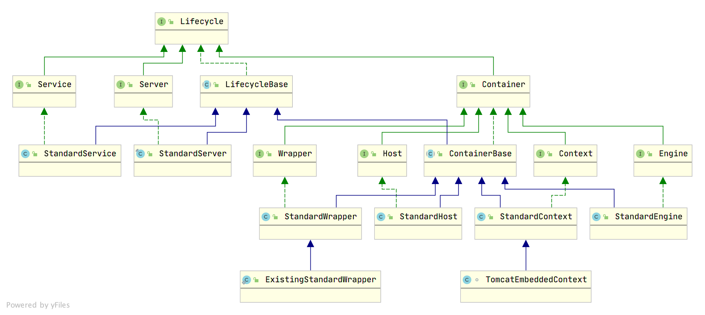
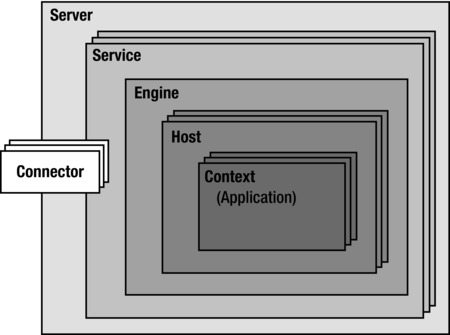
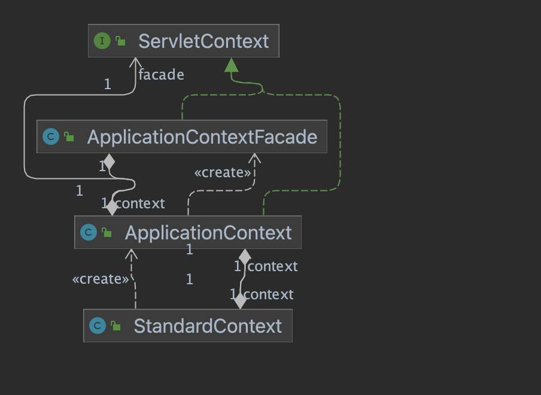

Catalina是Tomcat的servlet容器。一个Server就代表了一个完整的Catalina servlet container。





注意： **StandardService 和 StandardServer 不是 Container**

Server包含多个service，每个service包含一个 Engine，多个 Connector，还有一个Mapper对象。Mapper对象负责请求和servlet之间的对应关系，通过Service中的MapperListener对Mapper进行初始化。
```
Container[] conHosts = engine.findChildren();
for (Container conHost : conHosts) {
    Host host = (Host) conHost;
    if (!LifecycleState.NEW.equals(host.getState())) {
        // Registering the host will register the context and wrappers
        registerHost(host);
    }
}
```
因为请求到来时，通过连接端口就确定了connnector，connector可以确定service，从而确定Engine对象。所以Mapper中需要注册Host及再下几层的Container信息。

MapperListener还通过监听ContainerEvent事件保持Mapper信息的更新。MapperListener会在启动时注册到所有container中，它既是一个ContainerListener，又是一个LifecycleListener。
```
//递归
private void addListeners(Container container) {
    container.addContainerListener(this);
    container.addLifecycleListener(this);
    for (Container child : container.findChildren()) {
        addListeners(child);
    }
}
```

ContainerBase中，定义了 `HashMap<String, Container> children`，每个容器都可以拥有多个child。

因此：
一个StandardEngine(Engine)可以有多个Host,
一个StandardHost(Host)可以有多个Context,
一个StandardContext(Context)可以有多个Wrapper，
但是StandardWrapper比较特殊，它没有child。
> Refuse to add a child Container, because Wrappers are the lowest level of the Container hierarchy.

Wrapper是在往context添加servlet时初始化的，servlet会被包装成Wrapper，然后作为context的child添加进context。


Engine定义了一个service代表的servlet引擎，service获取container时，拿的就时Engine。
Host 代表一个虚拟主机，不同的hostname，代表不同的虚拟主机。比如localhost。
Context 代表一个webapp，比如一个war包就会被解析成一个Context。
Wrapper 就代表一个servlet，比如DispatcherServlet。


### Tomcat中的Context



1. servlet中的ServletContext
> Defines a set of methods that a servlet uses to communicate with its servlet container, for example, to get the MIME type of a file, dispatch requests, or write to a log file.

2. catalina中的StandardContext
> Standard implementation of the Context interface.Each child container must be a Wrapper implementation to process the requests directed to a particular servlet.

3. ApplicationContext
> Standard implementation of ServletContext that represents a web application's execution environment. An instance of this class is associated with each instance of StandardContext.

ApplicationContext是Tomcat对servletContext的一个标准实现。ApplicationContext在构造的时候，需要一个Context实例。

