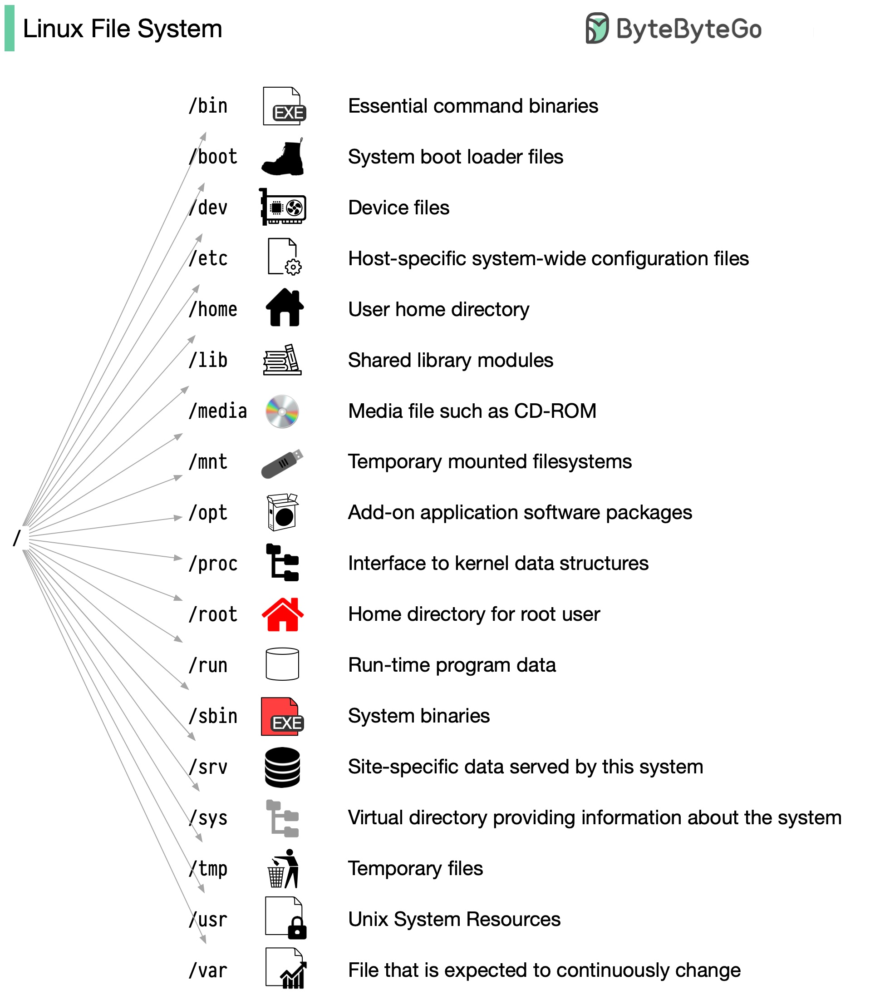
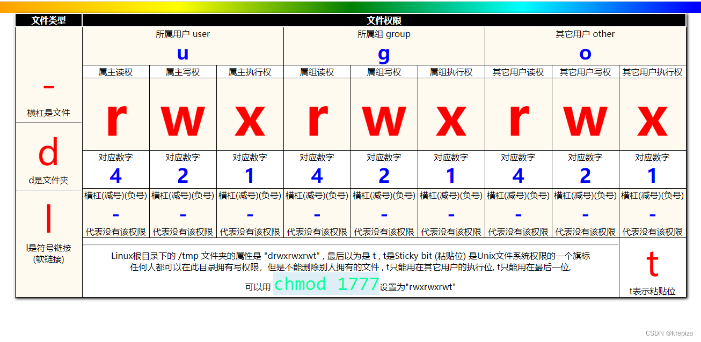

## Filesystem Hierarchy Standard
是 Linux/Unix 系统里非常重要的一个标准，它规定了 系统目录的组织方式和用途。

https://refspecs.linuxfoundation.org/FHS_3.0/fhs/index.html

### 1. 涵盖范围：
- 系统目录划分 
- 每个目录的用途 
- 文件放置位置的规范

### 2. 核心思想：
FHS 将文件系统分为两大类：

| 类别                 | 特点          | 举例                   |
| ------------------ | ----------- | -------------------- |
| **静态文件（Static）**   | 系统启动后不会频繁变动 | `/bin`、`/etc`、`/usr` |
| **可变文件（Variable）** | 系统运行过程中会被修改 | `/var`、`/tmp`        |

### 3. 目录分类（FHS 规范）



#### 根目录 /
所有路径的起点，根目录本身只包含最必要的子目录。

| 目录       | FHS 定义                             |
| -------- | ---------------------------------- |
| `/bin`   | 必需的用户命令，单用户模式也可运行（如 `ls`, `cp`）    |
| `/sbin`  | 必需的系统命令（`fsck`, `reboot`）          |
| `/etc`   | 系统配置文件（纯文本）                        |
| `/lib`   | 必需的共享库文件（给 `/bin` 和 `/sbin` 中的程序用） |
| `/root`  | root 用户的主目录                        |
| `/dev`   | 设备文件                               |
| `/tmp`   | 临时文件，系统重启可清空                       |
| `/mnt`   | 临时挂载点                              |
| `/media` | 可移动设备挂载点（U 盘、CD-ROM）               |

#### /usr（Unix System Resources）
主要存放 只读的用户程序和数据，是大多数应用的安装位置。

| 目录           | 作用                |
| ------------ | ----------------- |
| `/usr/bin`   | 非必须的用户命令          |
| `/usr/sbin`  | 非必须的系统命令          |
| `/usr/lib`   | 共享库               |
| `/usr/share` | 架构无关的共享数据（文档、字体）  |
| `/usr/local` | 本地安装的软件（不被包管理器覆盖） |

#### /var（Variable）
存放运行时会变化的文件，比如日志、缓存。

| 目录           | 作用            |
| ------------ | ------------- |
| `/var/log`   | 系统日志          |
| `/var/spool` | 队列文件（邮件、打印任务） |
| `/var/cache` | 缓存            |
| `/var/lib`   | 程序运行产生的持久化数据  |

#### /opt（Optional）
第三方应用软件安装位置，和 /usr/local 类似，但更适合大型独立应用（比如 /opt/google/chrome）。

#### /home
普通用户的主目录，每个用户一个子目录。

#### /proc & /sys
虚拟文件系统，由内核动态生成，不存储在磁盘中。
- /proc：进程与内核信息（/proc/cpuinfo, /proc/meminfo）
- /sys：硬件与内核对象（/sys/class/net）

#### /dev 设备文件
Linux 下 /dev 是 **设备文件（device file）** 的集中地，它并不是放普通数据文件的地方，而是内核提供的 设备接口。

##### 设备文件的本质 
- 每个 /dev 下的文件都映射到一个内核设备驱动（通过 主设备号 major 和 次设备号 minor）。
- 访问 /dev/sda 相当于在操作硬盘驱动，而不是一个普通文件。
- 分类：
  - 字符设备（c）：按字节流访问（键盘、串口）
  - 块设备（b）：按数据块访问（硬盘、SSD）
  - 特殊接口：并不直接映射到物理硬件（如 /dev/null）

##### 命名规则与常见设备

- 早期 Unix：设备文件是人工用 mknod 创建的。
- 现代 Linux：使用 udev（用户空间设备管理器）动态生成，热插拔设备也能即时创建/删除 /dev 下的文件。
- 命名规则由 udev 规则控制（在 /etc/udev/rules.d/）。

###### 磁盘与分区
| 设备类型             | 命名规则                         | 示例                       |
| ---------------- | ---------------------------- | ------------------------ |
| SATA/SCSI/USB 磁盘 | `/dev/sd[a-z]`               | `/dev/sda`, `/dev/sdb`   |
| 分区               | 磁盘名 + 数字                     | `/dev/sda1`, `/dev/sda2` |
| NVMe SSD         | `/dev/nvme[0-9]n[0-9]p[0-9]` | `/dev/nvme0n1p1`         |
| 虚拟块设备（loop）      | `/dev/loop[0-9]`             | `/dev/loop0`             |

###### 光驱、软盘
| 设备类型   | 命名规则           | 示例         |
| ------ | -------------- | ---------- |
| 光驱     | `/dev/sr[0-9]` | `/dev/sr0` |
| 软盘（老旧） | `/dev/fd[0-9]` | `/dev/fd0` |

###### 输入输出设备
| 设备类型   | 命名规则                    | 示例                  |
| ------ | ----------------------- | ------------------- |
| 终端     | `/dev/tty[0-9]`         | `/dev/tty1`         |
| 虚拟终端   | `/dev/pts/[n]`          | `/dev/pts/0`        |
| 串口     | `/dev/ttyS[0-9]`        | `/dev/ttyS0`        |
| USB 串口 | `/dev/ttyUSB[0-9]`      | `/dev/ttyUSB0`      |
| 鼠标     | `/dev/input/mouse[0-9]` | `/dev/input/mouse0` |

###### 特殊文件
| 名称             | 作用                   |
| -------------- | -------------------- |
| `/dev/null`    | 黑洞，写入数据直接丢弃，读取得到 EOF |
| `/dev/zero`    | 无限输出 `\0`            |
| `/dev/random`  | 真随机数生成器              |
| `/dev/urandom` | 伪随机数生成器              |
| `/dev/full`    | 写总是失败（磁盘满错误）         |

###### 内存、系统接口
| 名称          | 作用          |
| ----------- | ----------- |
| `/dev/mem`  | 物理内存访问接口    |
| `/dev/kmsg` | 内核日志接口      |
| `/dev/shm`  | 共享内存（tmpfs） |


### 4. 权限



### 5. 常用命令

`hier` – layout of filesystems
```shell
man hier
```

| 类别   | 命令                                 | 功能          |
| ---- | ---------------------------------- | ----------- |
| 查看信息 | `ls`, `stat`, `file`               | 查看文件信息和属性   |
| 路径操作 | `pwd`, `cd`, `tree`                | 查看当前路径与目录结构 |
| 文件管理 | `touch`, `mkdir`, `cp`, `mv`, `rm` | 创建、复制、移动、删除 |
| 权限管理 | `chmod`, `chown`, `umask`          | 修改权限与所有权    |
| 链接管理 | `ln`                               | 硬链接 vs 软链接  |
| 挂载管理 | `mount`, `umount`, `df`, `du`      | 查看挂载与磁盘使用   |
| 文件查找 | `find`, `locate`, `grep`           | 文件搜索与内容搜索   |

生僻命令解释：
- stat 
  > Linux stat 命令用于显示 inode 内容。inode 包含文件的元信息，具体来说有以下内容： 
  > - 文件的字节数
  > - 文件拥有者的 User ID 
  > - 文件的 Group ID 
  > - 文件的读、写、执行权限 
  > - 文件的时间戳，共有三个：
  >   - ctime 指 inode 上一次变动的时间，
  >   - mtime 指文件内容上一次变动的时间，
  >   - atime 指文件上一次打开的时间。 
  > - 链接数，即有多少文件名指向这个 inode 
  > - 文件数据 block 的位置

    ```shell
     # stat spring.log
     File: ‘spring.log’
     Size: 9747018         Blocks: 19048      IO Block: 4096   regular file
     Device: fd01h/64769d    Inode: 144913      Links: 1
     Access: (0644/-rw-r--r--)  Uid: (    0/    root)   Gid: (    0/    root)
     Access: 2025-08-10 14:07:12.274476234 +0800
     Modify: 2025-08-10 15:46:02.885081623 +0800
     Change: 2025-08-10 15:46:02.885081623 +0800
     Birth: -
    ```
- file
  > Linux file命令用于辨识文件类型。
  ```shell
  # file spring.log
  spring.log: ASCII text, with very long lines
  ```

- umask
  > Linux umask 命令用于设置默认权限掩码。它决定了新创建文件和目录的默认权限。
  > - 文件默认权限：666（rw-rw-rw-）
  > - 目录默认权限：777（rwxrwxrwx）
  > - umask 值会从默认权限中减去，形成实际权限。

    ```shell
    # 查看当前 umask 值
    umask
    # 输出类似：0022，表示新文件的默认权限为 644，目录为 755
    ```
- df(display free disk space)
  > Linux df 命令用于显示文件系统的磁盘空间使用情况。它可以显示每个挂载点的总空间、已用空间、可用空间和使用率。

    ```shell
    # 查看所有挂载点的磁盘使用情况
    df -h
    Filesystem      Size  Used Avail Use% Mounted on
    /dev/sda1       100G   50G   45G  53% /
    /dev/sdb1       200G  150G   40G  80% /data
    ```
- du(display disk usage statistics)
  > Linux du 命令用于显示目录或文件的磁盘使用情况。它可以递归地计算目录下所有文件和子目录的大小。
  
    ```shell
    # 查看当前目录及子目录的大小
    du -h --max-depth=1
    4.0K    ./dir1
    2.0M    ./dir2
    100M    .
    ```
- locate
  > Linux locate 命令用于快速查找文件。它使用预先构建的数据库来加速搜索速度。
  > locate 与 find 不同: find 是去硬盘找，locate 只在 /var/lib/slocate 资料库中找。
  > 缺点是数据可能不是最新的（延迟取决于数据库更新频率）。不能像 find 那样基于文件大小、时间等进行复杂条件过滤。
  
  ```shell
  # 查找所有以 .txt 结尾的文件
  locate *.txt
  /home/user/documents/file1.txt
  /var/log/syslog.txt
  ```

#### 6. 实验

创建一个 10MB 的虚拟磁盘文件，模拟一个磁盘分区。
```shell
dd if=/dev/zero of=/tmp/mydisk.img bs=1m count=10
```

把 /tmp/mydisk.img 这个原始磁盘镜像文件以裸盘形式加载到系统中，但不自动挂载里面的文件系统，只在系统层面创建一个虚拟磁盘设备
```shell
hdiutil attach -imagekey diskimage-class=CRawDiskImage -nomount /tmp/mydisk.img
```

格式化：
```shell
sudo newfs_hfs /dev/disk4
```

挂载：
```shell
sudo mount -t hfs /dev/disk4 /tmp/test
```

使用完成后卸载
```shell
sudo umount /mnt/test
hdiutil detach /dev/disk4
```

参考资料：
- https://bytebytego.com/guides/linux-file-system-explained/
- https://www.cnblogs.com/johnnyzen/p/15065474.html
